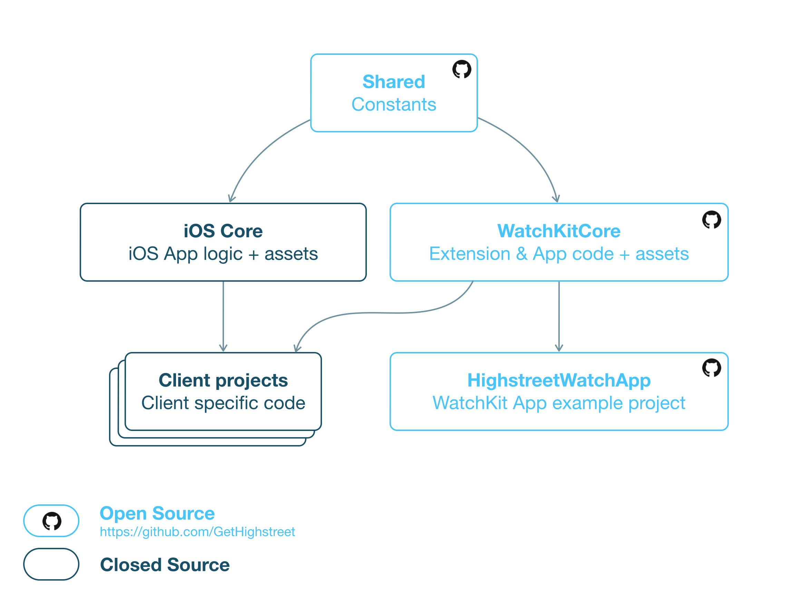

This repository contains an example Highstreet WatchKit app. This app is very similar to the one clients of the Highstreet platform get, except that in this case, the app loads dummy data. Highstreet platform clients also get a universal iOS app, but since that code is not open source, it is not part of this example project.

More information is available in this blog post where we announced that we'd open source the Highstreet WatchKit app: INSERT LINK HERE.

Here's a short walkthrough of the app:


If you want to run this app for yourself, follow the installation instructions below. If you want to look through the code & assets that power Highstreet WatchKit apps (including this example), open the WatchKitCore repository: https://github.com/GetHighstreet/WatchKitCore.

# Installation
After cloning this repository, the dependencies need to be set-up:

```
git submodule init
git submodule update --recursive
```

Alternatively, you can also run `carthage checkout`.

# Project Outline
Highstreet is a platform for mobile shopping apps. At the center of the platform, there is the ‘Highstreet iOS Core’. It contains all business logic and interface code for the iPhone & iPad app. The core is imported in each client project, where it is configured for that specific client. As a result, our customers all get an app that looks and feels like their brand, but the app shared 99% of the code with other Highstreet apps.

With the introduction of Apple Watch, the Highstreet platform now has a second 'core' that is used for the WatchKit Apps: WatchKitCore (this repository). WatchKitCore consists of two parts: the logic that is linked in every WatchKit Extension target (`WatchKitExtensionCore.framework`) and the assets for the WatchKit App target (storyboard, PNG sequences and other assets).

WatchKitCore on itself cannot run. It needs to be linked into a client project. This repository contains an example of such a client project. It does not contain the iPhone & iPad app (since those are not yet open source) and the WatchKit Extension therefore loads dummy data instead of requesting data from the 'parent application', but other than that it is very similar to how Highstreet platform client projects work.

The following diagram gives a broad impression of the Highstreet platform set-up:



# License
The code in this repository is licensed under the MIT License. All other assets are available under the CC BY 4.0 License. Please note the dependencies are licensed under their own respective licenses.